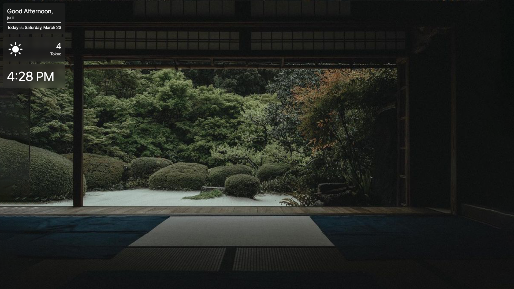
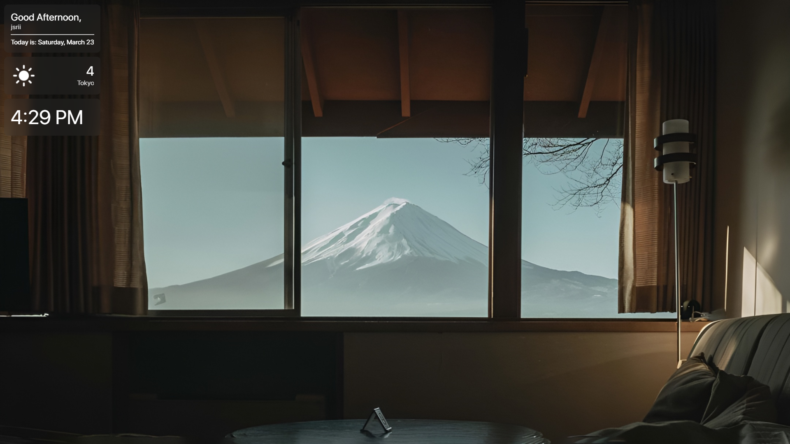

# webBackground

webBackground is a HTML wallpaper made for the windows program, Wallpaper Engine. This wallpaper is also heavily inspired by Apple Design Language and attempts to take a minimalistic approach to a wallpaper which displays useful info. This is the repository for the code itself if you would like to download the background and use it in Wallpaper Engine simply go to the link below:


<placeholder>


## Usage

The main thing you need to change is the value of the variable: ```name``` on line 14 in ```script.js```, which is located under the filepath, ```/scripts/script.js``` of the wallpaper itself which you can get to by simply right clicking on the wallpaper in wallpaper engine and clicking on "Open in Explorer".

If you wish to change the wallpapers that are already included with the wallpaper simply add/remove them accordingly to the array: ```backgroundArray``` on line 13, which again is located in ```script.js```.

## Features

 - Display a greeting
    - Depending on time (device's time)
 - Display the current data and a user-set name  
 - Display the current weather without user input
    - Done through IP geolocation (Not super accurate but does the job)
    - If your machine starts without internet click on the weather box to pull weather data
    - Uses Apple's weather Icons
 - Displaying the current time


 ## Known Issues
 - For whatever reasons the wallpaper has trouble loading images/animations but won't affect usage of it (Could just be my own devices?)
 - Current time scaling is kind of wonky for aspect ratios other than 16:9 so don't expect it to be perfect, I'm a novice at this kind of thing so forgive me

## So, What does it look like?






